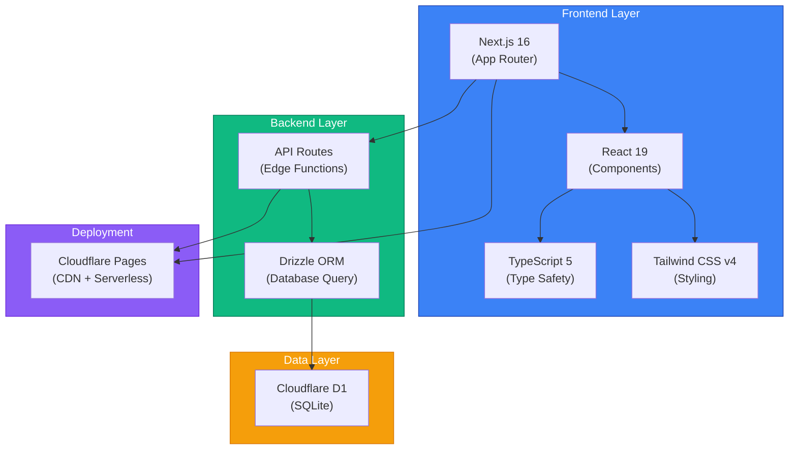

<div align="center">

# ShuttleArena 羽球竞技场

<svg width="100%" height="120" viewBox="0 0 800 120" xmlns="http://www.w3.org/2000/svg">
  <defs>
    <linearGradient id="headerGrad" x1="0%" y1="0%" x2="100%" y2="100%">
      <stop offset="0%" style="stop-color:#3b82f6;stop-opacity:1" />
      <stop offset="100%" style="stop-color:#1e40af;stop-opacity:1" />
    </linearGradient>
  </defs>
  <rect width="800" height="120" fill="url(#headerGrad)"/>
  <text x="400" y="50" font-size="48" font-weight="bold" fill="white" text-anchor="middle" font-family="Arial">🏸 ShuttleArena</text>
  <text x="400" y="85" font-size="20" fill="#e0f2fe" text-anchor="middle" font-family="Arial">Full-Stack Badminton Tournament Platform</text>
</svg>

**[English](README.md) | [中文](README_CN.md)**

[](https://github.com/hakupao)
[](https://www.typescriptlang.org/)
[](https://nextjs.org/)
[](https://react.dev/)
[](https://tailwindcss.com/)
[](https://pages.cloudflare.com/)
[](LICENSE)

</div>

---

## 📋 Overview

ShuttleArena is a comprehensive full-stack badminton tournament management system designed for seamless competition organization. From automated lottery grouping to real-time scoring and detailed statistics, it streamlines every aspect of badminton tournament operations.

**Live Demo:** [shuttle-arena-demo.pages.dev](https://shuttle-arena-demo.pages.dev)
**Demo Credentials:** `demo` / `demo123456`

---

## ✨ Key Features

<table>
<tr>
<td>🎲</td>
<td><strong>Lottery Draw System</strong><br/>Automatic group assignment based on seeding and balance</td>
</tr>
<tr>
<td>📅</td>
<td><strong>Smart Schedule Matrix</strong><br/>Conflict-free match scheduling with round-robin logic</td>
</tr>
<tr>
<td>⚡</td>
<td><strong>Real-Time Scoring</strong><br/>Live score updates with mobile-optimized interface</td>
</tr>
<tr>
<td>📊</td>
<td><strong>Player Statistics</strong><br/>Comprehensive analytics including rankings, win rates, and performance trends</td>
</tr>
<tr>
<td>📱</td>
<td><strong>Mobile-First Design</strong><br/>Touch-friendly scoring interface for courtside management</td>
</tr>
<tr>
<td>🔄</td>
<td><strong>Real-Time Synchronization</strong><br/>Instant updates across all connected devices</td>
</tr>
</table>

---

## 🏗️ Architecture



---

## 🚀 Tech Stack

| Component | Technology | Version |
|-----------|-----------|---------|
| **Framework** | Next.js | 16.0 |
| **UI Library** | React | 19.0 |
| **Language** | TypeScript | 5.0 |
| **Styling** | Tailwind CSS | 4.0 |
| **ORM** | Drizzle ORM | Latest |
| **Database** | Cloudflare D1 | SQLite |
| **Hosting** | Cloudflare Pages | - |
| **CI/CD** | GitHub Actions | - |

---

## 📸 Screenshots

<details>
<summary><strong>🏠 Home & Dashboard</strong></summary>

The intuitive homepage provides quick access to tournament management features and overview of ongoing tournaments.


</details>

<details>
<summary><strong>📅 Schedule Management</strong></summary>

Visual schedule matrix showing all matches with automatic conflict detection and optimization.


</details>

<details>
<summary><strong>🎯 Match Details & Scoring</strong></summary>

Real-time scoring interface with live point tracking and match progression.


</details>

<details>
<summary><strong>🏆 Leaderboard & Standings</strong></summary>

Comprehensive player statistics with rankings, win-loss records, and performance metrics.


</details>

<details>
<summary><strong>⚙️ Admin Panel</strong></summary>

Centralized administration dashboard for tournament setup and management.


</details>

<details>
<summary><strong>📱 Mobile Scoring Interface</strong></summary>

Touch-optimized interface for managing scores directly from courtside.


</details>

---

## 🚀 Getting Started

### Prerequisites
- Node.js 18+
- pnpm or npm
- Cloudflare account (for D1 and Pages deployment)

### Installation

```bash
# Clone the repository
git clone https://github.com/hakupao/badminton-tournament-v2.git
cd badminton-tournament-v2

# Install dependencies
pnpm install

# Set up environment variables
cp .env.example .env.local

# Development server
pnpm dev
```

Open [http://localhost:3000](http://localhost:3000) in your browser.

### Deployment

```bash
# Deploy to Cloudflare Pages
pnpm run deploy
```

---

## 📖 Usage Guide

<details>
<summary><strong>🎲 Creating a Tournament</strong></summary>

1. Navigate to **Tournaments** → **Create New**
2. Enter tournament details (name, date, format)
3. Add participating players
4. Configure group settings and seeding preferences
5. Generate schedule with one click

</details>

<details>
<summary><strong>📋 Managing Groups & Brackets</strong></summary>

1. Use the **Lottery Draw** system for fair group assignment
2. Adjust group composition manually if needed
3. View conflict-free match scheduling
4. Export schedule to PDF or Excel

</details>

<details>
<summary><strong>🎯 Recording Scores</strong></summary>

1. Open match details during gameplay
2. Use the mobile-friendly scoring interface
3. Points update in real-time across all devices
4. Automatic ranking recalculation

</details>

<details>
<summary><strong>📊 Viewing Statistics</strong></summary>

1. Access the **Standings** section
2. Filter by group or tournament
3. View detailed player statistics
4. Export performance reports

</details>

---

## 🔄 CI/CD Pipeline

The project uses GitHub Actions for automated testing and deployment:

```yaml
# Workflow: Build, Test, and Deploy
- Linting (ESLint, Prettier)
- Type checking (TypeScript)
- Unit & Integration tests
- E2E tests
- Automatic deployment to Cloudflare Pages
```

---

## 🛠️ Development

### Project Structure

```
badminton-tournament-v2/
├── src/
│   ├── app/              # Next.js app router
│   ├── components/       # React components
│   ├── lib/             # Utility functions
│   ├── styles/          # CSS & Tailwind
│   └── types/           # TypeScript definitions
├── public/              # Static assets
├── docs/               # Documentation & screenshots
├── wrangler.toml       # Cloudflare configuration
└── package.json
```

### Available Scripts

```bash
pnpm dev          # Start development server
pnpm build        # Production build
pnpm start        # Start production server
pnpm lint         # Run ESLint
pnpm type-check   # TypeScript type checking
pnpm test         # Run tests
pnpm deploy       # Deploy to Cloudflare Pages
```

---

## 🌐 Internationalization

The application supports multiple languages through i18n configuration. Customize language settings in the UI preferences.

---

## 🔒 Security

- Input validation and sanitization
- SQL injection prevention through Drizzle ORM
- HTTPS-only communication
- Secure authentication for admin features
- CORS configured for trusted origins

---

## 📄 License

This project is licensed under the MIT License - see the [LICENSE](LICENSE) file for details.

---

## 🤝 Contributing

Contributions are welcome! Please feel free to submit a Pull Request.

1. Fork the repository
2. Create your feature branch (`git checkout -b feature/AmazingFeature`)
3. Commit your changes (`git commit -m 'Add some AmazingFeature'`)
4. Push to the branch (`git push origin feature/AmazingFeature`)
5. Open a Pull Request

---

## 📞 Support

For issues, questions, or suggestions, please open an [issue](https://github.com/hakupao/badminton-tournament-v2/issues) on GitHub.

---

<div align="center">

**Made with ❤️ by [hakupao](https://github.com/hakupao)**

[⬆ back to top](#shuttlearena-羽球竞技场)

</div>
