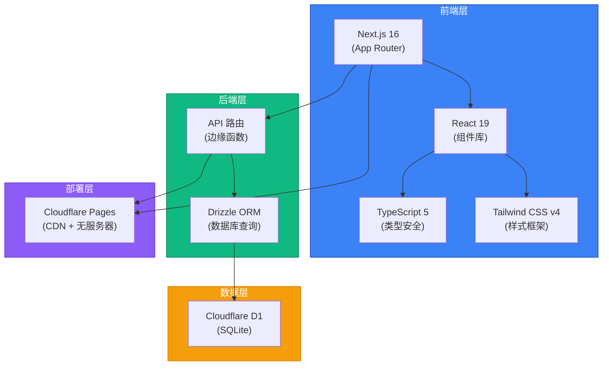
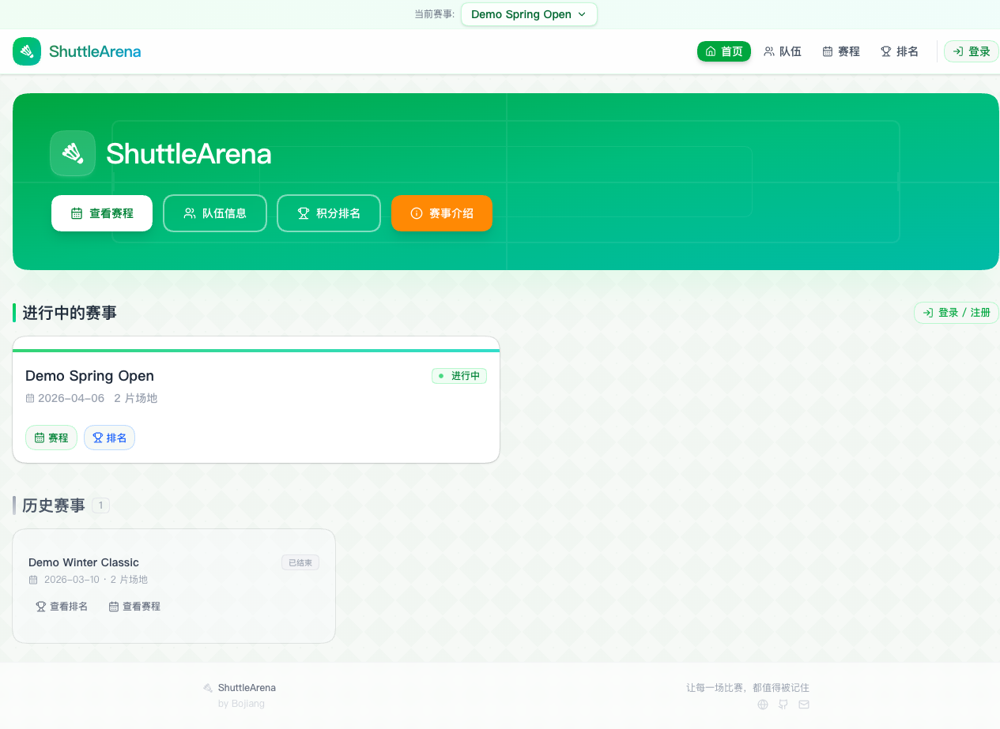
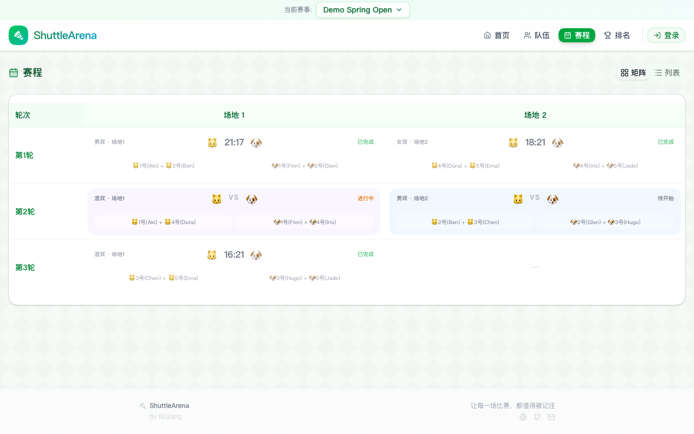
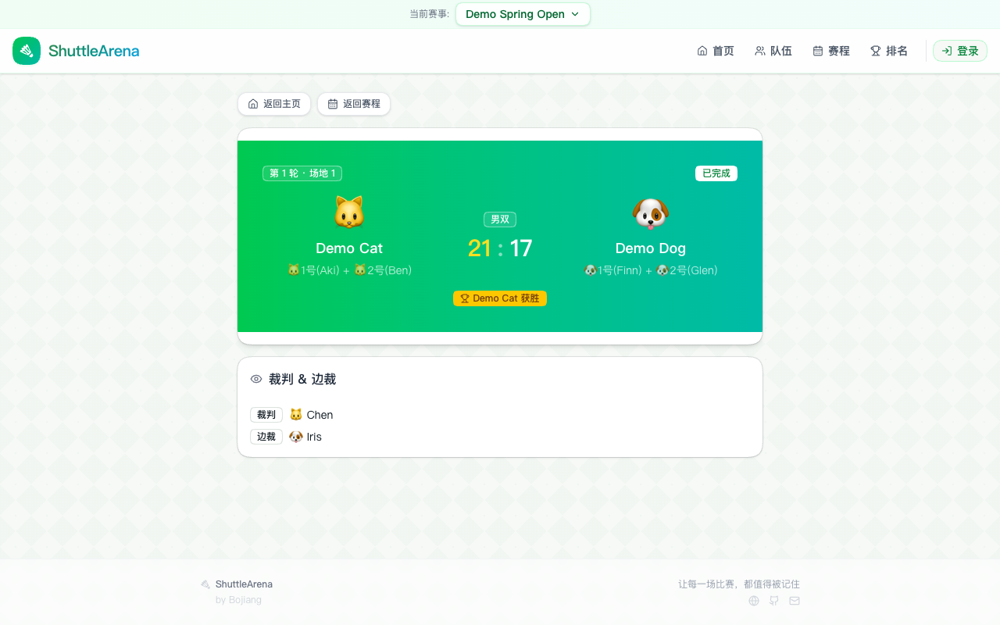
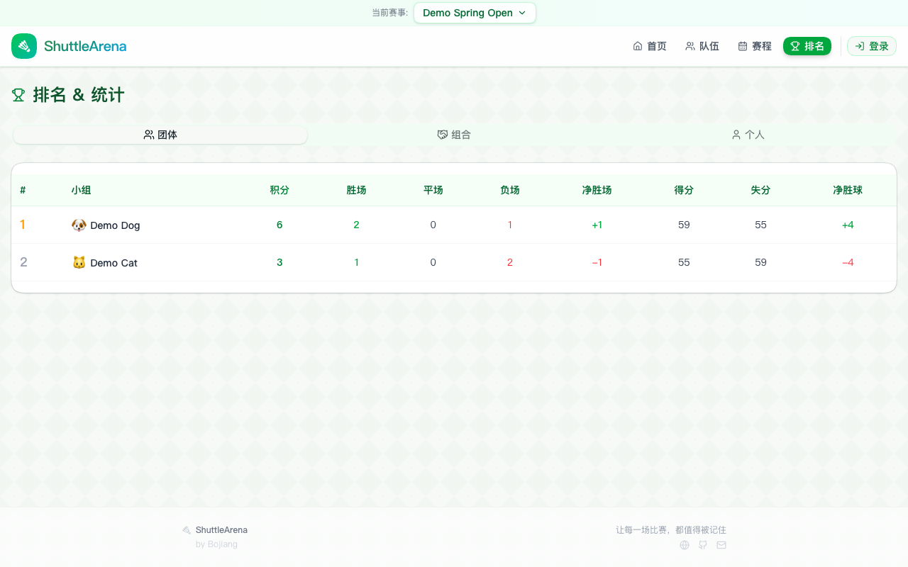
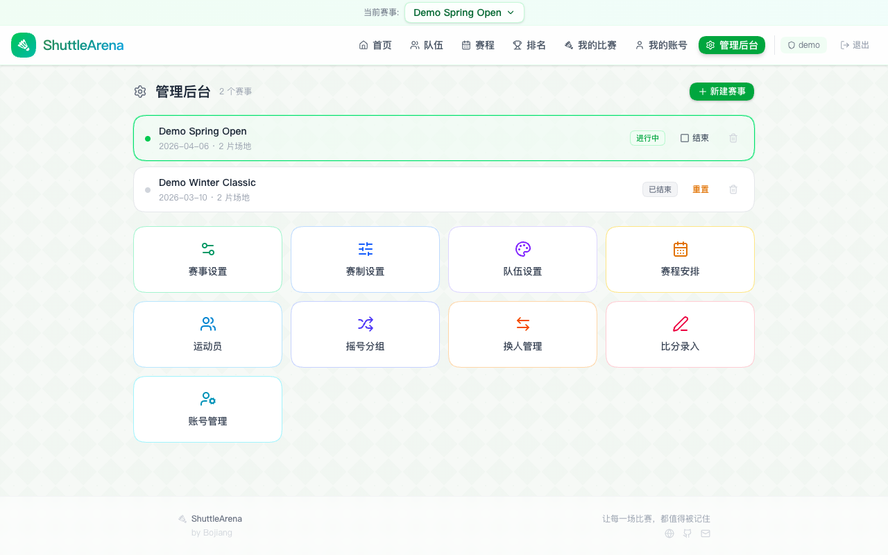
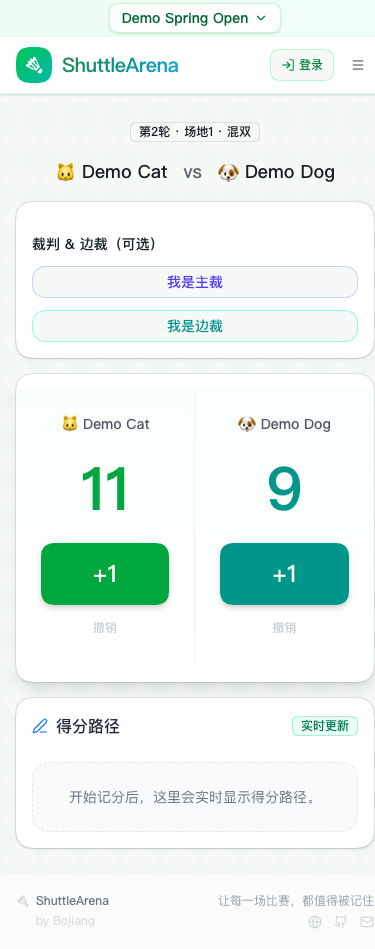

<div align="center">

# ShuttleArena 羽球竞技场


**[English](README.md) | [中文](README_CN.md)**

[](https://github.com/hakupao)
[](https://www.typescriptlang.org/)
[](https://nextjs.org/)
[](https://react.dev/)
[](https://tailwindcss.com/)
[](https://pages.cloudflare.com/)
[](LICENSE)

</div>

---

## 📋 项目简介

ShuttleArena 是一个功能完整的全栈羽毛球赛事管理系统，旨在简化赛事组织流程。从自动抽签分组、日程安排生成，到实时计分和详细数据统计，覆盖赛事管理的每个环节。

**在线演示:** [shuttle-arena-demo.pages.dev](https://shuttle-arena-demo.pages.dev)
**演示账号:** `demo` / `demo123456`

---

## ✨ 核心功能

<table>
<tr>
<td>🎲</td>
<td><strong>抽签分组系统</strong><br/>基于种子排名和平衡算法的自动分组</td>
</tr>
<tr>
<td>📅</td>
<td><strong>智能日程矩阵</strong><br/>无冲突的循环赛日程自动生成</td>
</tr>
<tr>
<td>⚡</td>
<td><strong>实时计分系统</strong><br/>移动端友好的即时计分界面</td>
</tr>
<tr>
<td>📊</td>
<td><strong>玩家统计分析</strong><br/>包含排名、胜率、成绩趋势等全方位数据</td>
</tr>
<tr>
<td>📱</td>
<td><strong>移动优先设计</strong><br/>在赛场边也能轻松管理比赛</td>
</tr>
<tr>
<td>🔄</td>
<td><strong>实时数据同步</strong><br/>跨设备无延迟更新</td>
</tr>
</table>

---

## 🏗️ 架构设计



---

## 🚀 技术栈

| 组件 | 技术 | 版本 |
|------|------|------|
| **框架** | Next.js | 16.0 |
| **UI 库** | React | 19.0 |
| **编程语言** | TypeScript | 5.0 |
| **样式** | Tailwind CSS | 4.0 |
| **ORM** | Drizzle ORM | 最新 |
| **数据库** | Cloudflare D1 | SQLite |
| **部署平台** | Cloudflare Pages | - |
| **CI/CD** | GitHub Actions | - |

---

## 📸 功能截图

<details>
<summary><strong>🏠 首页 & 仪表板</strong></summary>

直观的首页，可快速访问赛事管理功能和正在进行的赛事概览。



</details>

<details>
<summary><strong>📅 日程管理</strong></summary>

可视化日程矩阵，展示所有比赛信息，自动检测和优化冲突。



</details>

<details>
<summary><strong>🎯 比赛详情 & 计分</strong></summary>

实时计分界面，提供即时比分追踪和比赛进度更新。



</details>

<details>
<summary><strong>🏆 排名 & 积分榜</strong></summary>

全面的玩家数据统计，包括排名、胜负记录和性能指标。



</details>

<details>
<summary><strong>⚙️ 管理后台</strong></summary>

集中式管理仪表板，用于赛事设置和管理。



</details>

<details>
<summary><strong>📱 移动计分界面</strong></summary>

触屏优化的界面设计，方便在赛场边直接管理比分。



</details>

---

## 🚀 快速开始

### 系统要求
- Node.js 18+
- pnpm 或 npm
- Cloudflare 账号（用于 D1 和 Pages 部署）

### 安装步骤

```bash
# 克隆仓库
git clone https://github.com/hakupao/badminton-tournament-v2.git
cd badminton-tournament-v2

# 安装依赖
pnpm install

# 配置环境变量
cp .env.example .env.local

# 启动开发服务器
pnpm dev
```

在浏览器中打开 [http://localhost:3000](http://localhost:3000)。

### 部署

```bash
# 部署到 Cloudflare Pages
pnpm run deploy
```

---

## 📖 使用指南

<details>
<summary><strong>🎲 创建赛事</strong></summary>

1. 进入 **赛事** → **新建赛事**
2. 输入赛事信息（名称、日期、格式）
3. 添加参赛选手
4. 配置分组设置和种子排名
5. 一键生成日程

</details>

<details>
<summary><strong>📋 管理分组 & 赛制</strong></summary>

1. 使用 **抽签分组** 系统进行公平分组
2. 根据需要手动调整分组
3. 查看无冲突的比赛日程
4. 导出 PDF 或 Excel 格式

</details>

<details>
<summary><strong>🎯 录入比分</strong></summary>

1. 在比赛过程中打开比赛详情
2. 使用移动友好的计分界面
3. 比分实时更新到所有设备
4. 自动重新计算排名

</details>

<details>
<summary><strong>📊 查看数据统计</strong></summary>

1. 访问 **积分榜** 部分
2. 按分组或赛事筛选
3. 查看详细的玩家统计
4. 导出性能报告

</details>

---

## 🔄 CI/CD 流程

项目使用 GitHub Actions 实现自动化测试和部署：

```yaml
# 工作流：构建、测试、部署
- 代码检查 (ESLint, Prettier)
- 类型检查 (TypeScript)
- 单元测试 & 集成测试
- 端到端测试
- 自动部署到 Cloudflare Pages
```

---

## 🛠️ 开发相关

### 项目结构

```
badminton-tournament-v2/
├── src/
│   ├── app/              # Next.js 应用路由
│   ├── components/       # React 组件
│   ├── lib/             # 工具函数
│   ├── styles/          # CSS & Tailwind
│   └── types/           # TypeScript 类型定义
├── public/              # 静态资源
├── docs/               # 文档 & 截图
├── wrangler.toml       # Cloudflare 配置
└── package.json
```

### 常用命令

```bash
pnpm dev          # 启动开发服务器
pnpm build        # 生产环境构建
pnpm start        # 启动生产服务器
pnpm lint         # 运行 ESLint
pnpm type-check   # TypeScript 类型检查
pnpm test         # 运行测试
pnpm deploy       # 部署到 Cloudflare Pages
```

---

## 🌐 多语言支持

该应用通过 i18n 配置支持多种语言。在 UI 首选项中自定义语言设置。

---

## 🔒 安全性

- 输入验证和清理
- 通过 Drizzle ORM 防止 SQL 注入
- HTTPS 强制加密通信
- 管理功能的安全身份验证
- 为信任源配置的 CORS

---

## 📄 许可证

此项目采用 MIT 许可证 - 详见 [LICENSE](LICENSE) 文件。

---

## 🤝 贡献指南

欢迎贡献！请随时提交 Pull Request。

1. Fork 该仓库
2. 创建特性分支 (`git checkout -b feature/AmazingFeature`)
3. 提交更改 (`git commit -m 'Add some AmazingFeature'`)
4. 推送到分支 (`git push origin feature/AmazingFeature`)
5. 打开 Pull Request

---

## 📞 获取帮助

如有问题、疑问或建议，请在 GitHub 上提交 [issue](https://github.com/hakupao/badminton-tournament-v2/issues)。

---

<div align="center">

**用❤️ 打造，作者：[hakupao](https://github.com/hakupao)**

[⬆ 回到顶部](#shuttlearena-羽球竞技场)

</div>
